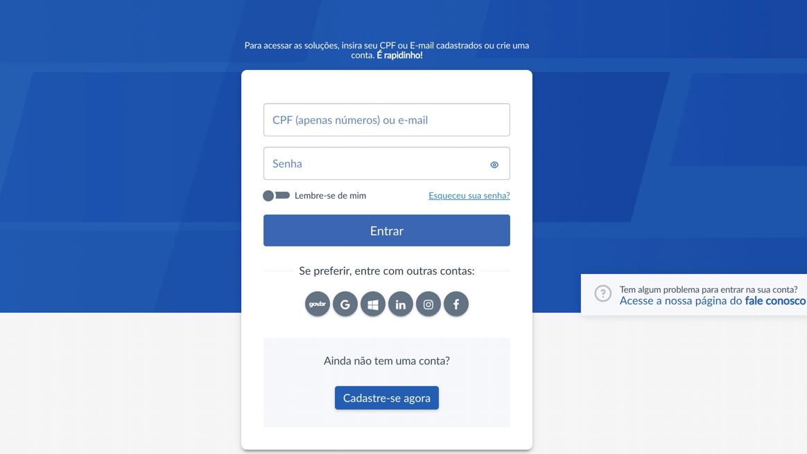
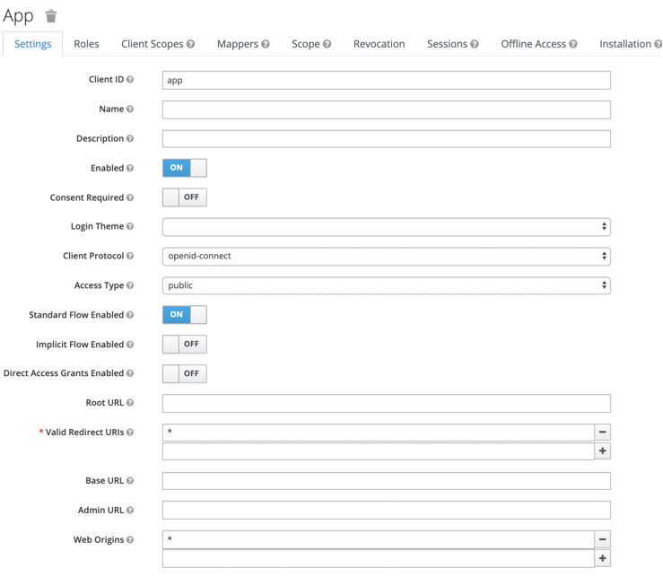
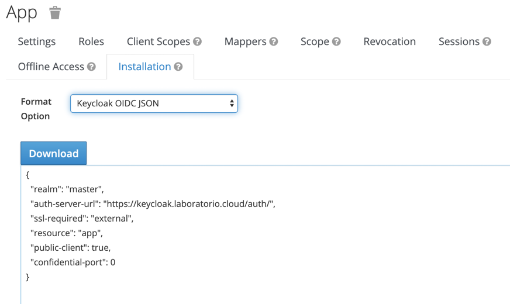
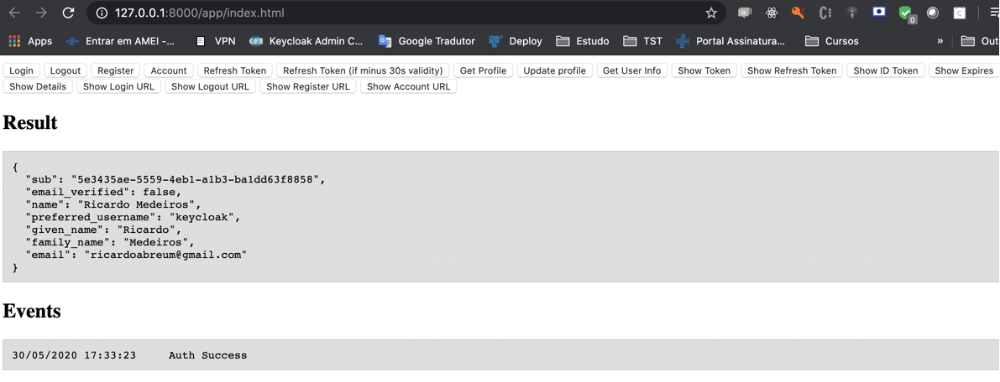

# Keycloak

O keycloak é um projeto open-source de Gestão de Identidade mantido pela Redhat com a comunidade altamente ativa. 

Os principais protocolos utilizandos são o OpenID e o SAML. 

O projeto está disponível em: https://www.keycloak.org

# Por que utilizar o Keycloak?

Para ter soluções stateless é importante não manter sessão de usuário logado na aplicação, pois isso dificulta o escalonamento vertical de uma aplicação. 

Com essa solução é possível tirar a responsabilidade de manter a sessão de usuário logado da aplicação e delegar para o keycloak. 

Além de gerenciar os usuários logados na aplicação, o keylcloak é uma solução completa de gestão de identidade, capaz de gerir perfis de acesso, manter conta de usuário, integrar com LDAP, fazer SSO com kerberus e outras funcionalidades. 

Existem outras soluções parecidas, porém a comunidade não é tão ativa como a do keycloak que é mantida pela grande empresa Redhat.


# Instalação

## Instalação em Standalone (ambiente de teste)

Para esse tipo de instalação é necessário ter o docker instalado. Caso não tenha o docker instalado execute o comando abaixo:


```bash
#mac ou linux
curl https://get.docker.com | bash
```

Execute o keycloak:

```bash
docker run -e KEYCLOAK_USER=keycloak -e KEYCLOAK_PASSWORD=123456 -p 8080:8080 jboss/keycloak
```

* Acesse: http://localhost:8080
* Login: keycloak
* Senha: 123456


Referência: https://github.com/keycloak/keycloak-containers/blob/10.0.1/server/README.md

## Instalação em HA (ambiente de produção)

O keycloak usa a infraestrutura do Jboss Widfly para possibitar o cluster entre máquinas e até entre datacenter.


Referência: https://www.keycloak.org/docs/latest/server_installation/index.html#crossdc-mode

Uma forma simples de configurar o keycloak em HA é utilizando HELM.

* Instalação do repo:
```bash
helm repo add codecentric https://codecentric.github.io/helm-charts
```

* Instalação do helm:

```bash
## Crie o namespace no kubernetes com o nome de keycloak antes de executar o comando.
## A senha deve ter letras e número e no mínimo 8 caracteres
helm install keycloak --set keycloak.password=abcd1234,keycloak.persistence.dbVendor=postgres,keycloak.persistence.deployPostgres=true,keycloak.replicas=2  codecentric/keycloak -n keycloak
```

### Boas práticas para utilização do HELM

Seguem algumas informações importantes:

* Defina a quantidade de réplicas para no mínimo 2 (duas);
* Configure a quantidade da variável CACHE_OWNERS para no mínimo 2 (dois);
* É altamente recomendado disponibiliza o tema personalizado do keycloak em uma imagem [docker customizada](https://github.com/codecentric/helm-charts/tree/master/charts/keycloak#providing-a-custom-theme);
* Defina limites de CPU e memória. O keycloak pode derrubar o node se isso não for configurado.
* Configure o parâmetro "nginx.ingress.kubernetes.io/affinity: cookie" no ingress. Ele ajuda a criar uma afinidade por node e otimização a performance.
* Configure o parâmetro "nginx.ingress.kubernetes.io/proxy-buffer-size: 128k" no ingress, caso contrário pode ocorrer problemas na autenticação por causa do tamanho da requisição.
* 

Referência: https://github.com/codecentric/helm-charts/tree/master/charts/keycloak

## Customização de telas

É possível mudar completamente a tela de login, gestão da conta do usuário e administração. 

A recomendação é não fazer alterações da tela de administração, pois dificulta a atualização da versão do keycloak.

Exemplo:



Referência: https://www.keycloak.org/docs/latest/server_development/#_themes

## Integrando uma aplicação Web

A integração pode ser feita por qualquer fluxo previsto no OpenId (Authorization Code, Password, Implict, Client Credentials). Existem vários [frameworks compartíveis](https://www.keycloak.org/docs/latest/securing_apps/index.html#what-are-client-adapters), porém a forma mais simples e indicada de ser realizar a integração é utilizando o keycloak.js. 

Abordaremos a integração com o keycloak.js que leva 3 minutos. Segue os passos necessários:

1. Crie um cliente no keycloak chamado app com "Access Type" igual a "public" e com "Standard Flow Enabled" habilitado.



2. Acesse a aba Installation, escolhe o tipo Keycloak OIDC JSON e baixe o json. Essa é o arquivo de integração.



3. Coloque o arquivo keycloak.json e [index.html](app/index.html) em um servidor web qualquer e acesse a página index.html.




